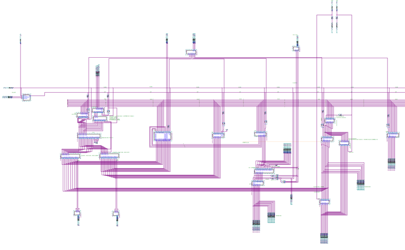
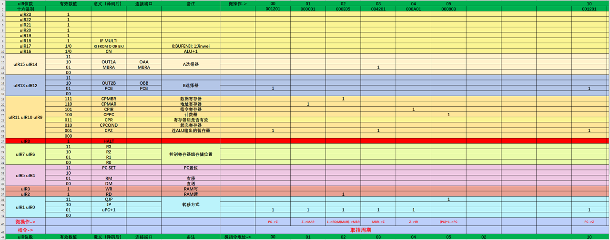
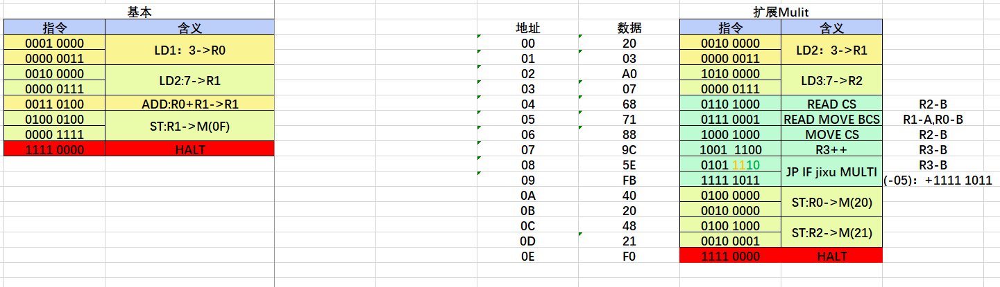

# Prototype-with-Quartus
A prototype designed by Quartus, by simulating the structural design of the CPU.

*如果觉得有帮助的话，请多多**star***

## 项目介绍
此项目动机为山东大学软件学院2020级计算机组织与结构课程设计，此项目完成了实验一到实验四、模型机的设计和模型机的扩展。2020级题目详见ppt，此项目内容如下：
- Experiment1-4实现了实验一到实验四，这些基本上每年是固定的
- WholeMachine实现了模型机所需要的所有元器件以及模型机结构，WholeMachine文件夹内**model_machine**实现了基础要求：即使用LD、ADD、ST、HALT指令完成取数、相加、存储结果以及停机的整个流程。**model_machine_advanced**实现了当年的扩展要求，即条件跳转和采用原码一位乘的思想实现两个8位无符号数相乘。

## 项目参考思路
1. 学习Experiment1-4中实现的内容，其中Experiment1-2的目的为设计模型机需要的基础元器件，Experiment3的目的为学会使用前期设计的基本元器件构成整体电路，Experiment4目的是学会使用微指令控制3中设计的电路完成对应任务。每个实验环环相扣，层层递进，而只有完成四个实验，方有设计模型机及其扩展的能力。
2. 学习模型机的结构和执行流程。其中微指令在WholeMachine/微指令.xlsx中。运行模型机时，首先烧写电路，随后使用串口软件下载微指令到ROM，根据微指令编写指令并下载到RAM，最后给一个启动信号，机器开始执行指令所定义的流程。

